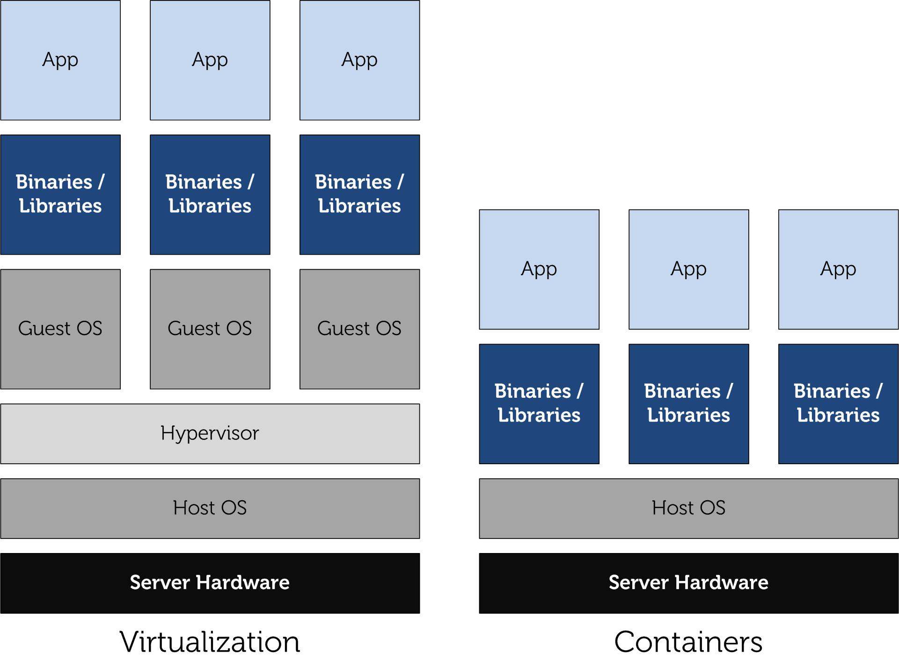
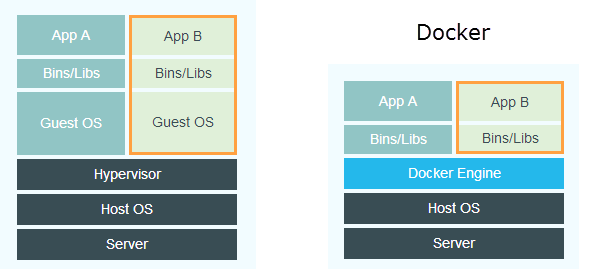

# Docker

## Konular
  * Docker nedir ?
  * Tarihçesi ve LXC (Linux Containers)
  * Container teknolojisi neden bu kadar önemli ?
  * Çalışma Mantığı

### Docker nedir?

Docker, konteyner(container) olarak da bilinen "işletim sistemi seviyesinde sanallaştırma" sağlayan bir yazılımdır.

Bu tanım Docker'ın en sade tanımı, fakat yine de size pek bir şey ifade etmemiş olabilir. Sabırlı olun bu makalenin sonlarına doğru ne demek istediğimizi anlayacaksınız.

### Tarihçesi ve LXC (Linux Containers)
Her şey, 6 Ağustos 2008'de Linux Containers adı verilen methodun piyasaya sürülmesiyle başladı. Linux Containers denilen yapı, birden fazla izole edilmiş Linux sistemin(container) tek bir host üzerinde çalışması için işletim sistemi seviyesinde sanallaştırma metodudur.

Linux çekirdeği, kaynakların sınırlandırılmasını ve ölçeklendirilmesini sağlayan **cgroups** ve bir uygulamanın çalışma ortamını görünümünü tamamen izole etmek için kullanılan **namespace isolation** desteği sağlar.

*Linux Containers ile normal sanallaştırma arasındaki fark belirtilmiştir.*

### Container teknolojisi neden bu kadar önemli ?

Container teknolojisi ile Hypervisor (klasik sanallaştırma) teknolojisine göre sanallaştırma için gereken disk alanından ciddi tasarruf sağlanmaktadır.

Sanal olarak çalıştırılan işletim sistemlerinin her birinin;
* 8 GB disk alanı
* 2 GB RAM
* 1 Core gerektirdiğini düşünelim.

**Klasik Hypervisor teknolojisi kullanırsak:**
* 20 * 8 GB = 160 GB disk alanı
* 20 * 2 GB = 40 GB RAM
* 20 * 1 = 40 Core'a ihtiyacımız olacaktır.

**20 adet sanal sunucu kurmak yerine LXC (Linux Containers) ile sanallaştırma yaptığımızda:**
* 8 GB disk alanı
* 2 GB RAM
* 1 Core bize yeterli olacaktır.

Ayrıca LXC'nin avantajları bununla da sınırlı değil. Hypervisor ile yapılan sanallaştırmada her bir işletim sisteminin ayrı ayrı bakımının yapılması gerekmektedir. Tek bir işletim sistemi içinde LXC kullanılarak yapılan sanallaştırmada ise tek bir işletim sisteminin bakımı yapılarak daha ekonomik bir yapı sunulur.

LXC, 2008 yılında ortaya çıkmasına ve kendisine ciddi kullanım alanı bulmasına rağmen asıl ününe 2013 yılında ortaya çıkan **Docker** sayesinde kavuşmuştur.

*Docker'ın ilk sunumu (Pycon)*

### Çalışma Mantığı

